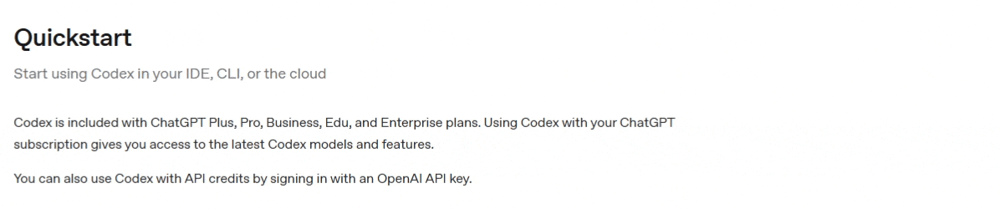

# LLM Translator

[中文](README.zh.md)

Turn any webpage into your preferred language in a click. This Chrome extension translates highlighted text or whole pages using either a **local Ollama model** or **OpenAI ChatGPT**.

PS: This extension was written by Claude Code in 10 minutes.
# Translate Sentences

# Translate Whole Page


# Before installing
If you need a translator, I strongly suggest you download Claude Code and write a single, simple prompt — Claude can build EVERYTHING for you. If you still want to try this extension, continue to the installation steps below.

# Install locally (Chrome)
1. Open `chrome://extensions/`.
2. Enable "Developer mode" (top right).
3. Click "Load unpacked" and select this folder: `C:\dev\local-translator`.
4. Pin the extension if you want quick access from the toolbar.

## Set up Ollama (local)
1. Install Ollama and make sure it is running.
2. Start Ollama with CORS enabled for extensions:
   - Windows PowerShell:
     ```powershell
     $env:OLLAMA_ORIGINS="*"; ollama serve
     ```
3. In the extension popup:
   - Provider: **Ollama (Local)**
   - Ollama API URL: `http://localhost:11434`
   - Model Name: for example `llama3.2`, `mistral`, `qwen2.5`
4. Click **Save Settings** to validate the connection.

## Set up ChatGPT (OpenAI)
1. Get an OpenAI API key.
2. In the extension popup:
   - Provider: **OpenAI GPT**
   - API Key: your key (starts with `sk-`)
   - GPT Model: choose a model (default is `gpt-4o-mini`)
3. Click **Save Settings** to validate the connection.

## How to use
- Select text on any webpage to reveal the **Translate** button.
- Click **Translate** to swap the selection with the translated text.
- Click a translated span to toggle **Translate/Revert** for that text.
- Use **Translate Page** or **Revert All** from the popup for page-level actions.
